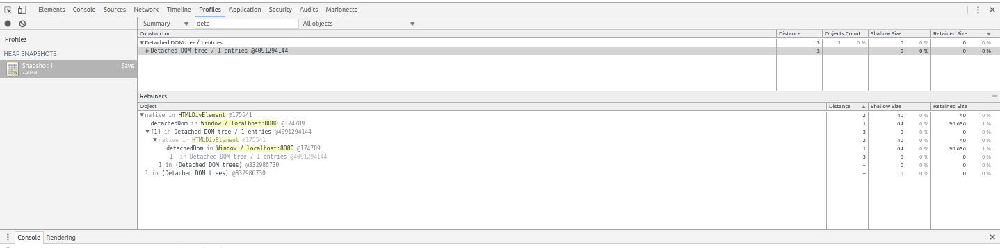
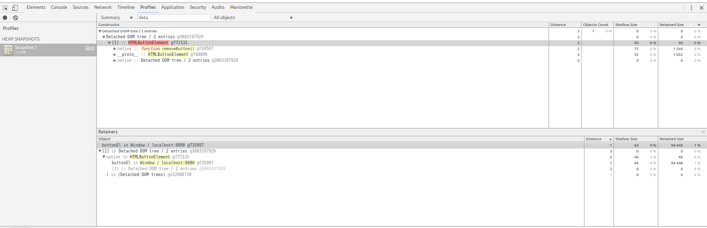

# sandbox-memory-leak

memory leak samples

## Detached DOM

[detached-dom-1.html](./src/detached-dom-1.html)

```js
var detachedDom = document.createElement('div');
```




[detached-dom-2.html](./src/detached-dom-1.html)

```html
    <button id="button">button</button>
    <script>
      var buttonEl = document.getElementById('button');

      buttonEl.addEventListener('click', removeButton);

      function removeButton() {
        document.body.removeChild(document.getElementById('button'));
      }
    </script>

```




## references

* https://auth0.com/blog/four-types-of-leaks-in-your-javascript-code-and-how-to-get-rid-of-them/
* http://stackoverflow.com/questions/11930050/finding-js-memory-leak-in-chrome-dev-tools
